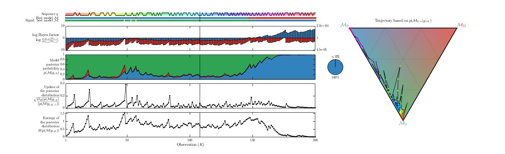
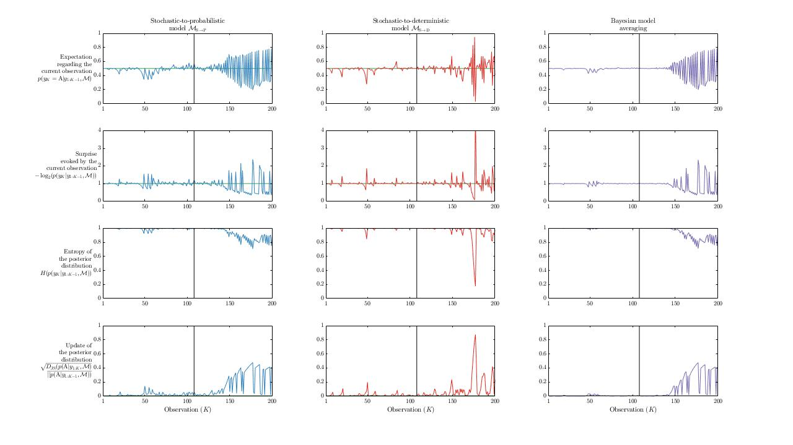

# Ideal observer

## Scripts and functions

The different observers available are:
* ```Emergence_IO_Bernoulli``` estimates the frequency of A and B.
* ```Emergence_IO_Markov``` estimates the frequency of first-order transitions (A|A, A|B, B|A, and B|B).
* ```Emergence_IO_Chain``` estimates the frequency of transitions of any order.
* ```Emergence_IO_Tree``` detects repetition of pattern of any length up to a given limit.

The full Bayesian ideal observer of the task is implemented in  ```Emergence_IO_FullIO``` and considers there might be a change point in the sequence separating a fully-stochastic part from a regular part that can be described using one of the previous observers.

Toy examples scripts are available for each of there observers.

## Full Bayesian ideal observer of the task

Here is the result of the inference by the full Bayesian ideal observer of the task (the function ```Emergence_IO_FullIO```).
These figures can be reproduced using the script ```Emergence_IO_ToyExampleFullIO```.

### Posterior probability of

We estimate the posterior probability of each possible model:

<a href="https://www.codecogs.com/eqnedit.php?latex=p\left(\mathcal{M}_{i}|y\right)&space;=&space;\frac{p\left(y|\mathcal{M}_{i}\right)&space;\cdot&space;p\left(\mathcal{M}_{i}\right)}{p\left(y\right)}" target="_blank"></a>

The first group of plots display the posterior distribution over models (and related metrics).

<p align="center">
  
</p>

### Posterior distribution over models' parameters

The second group of plots display the posterior distribution over models' parameters.

<p align="center">
  
</p>

### Posterior distribution over change point's position

The third group of plots display the posterior distribution over change point's position (and related metrics).

<p align="center">
  
</p>

### Expectation and surprise

The fourth group of plots display the expectations regarding the identity of the next observation (and related metrics).

<p align="center">
  
</p>
