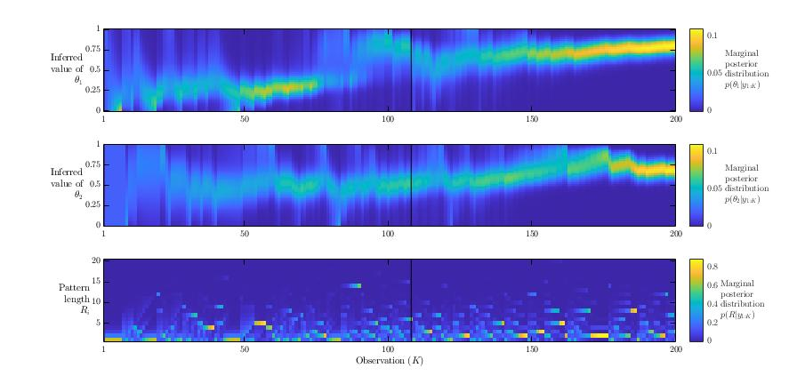
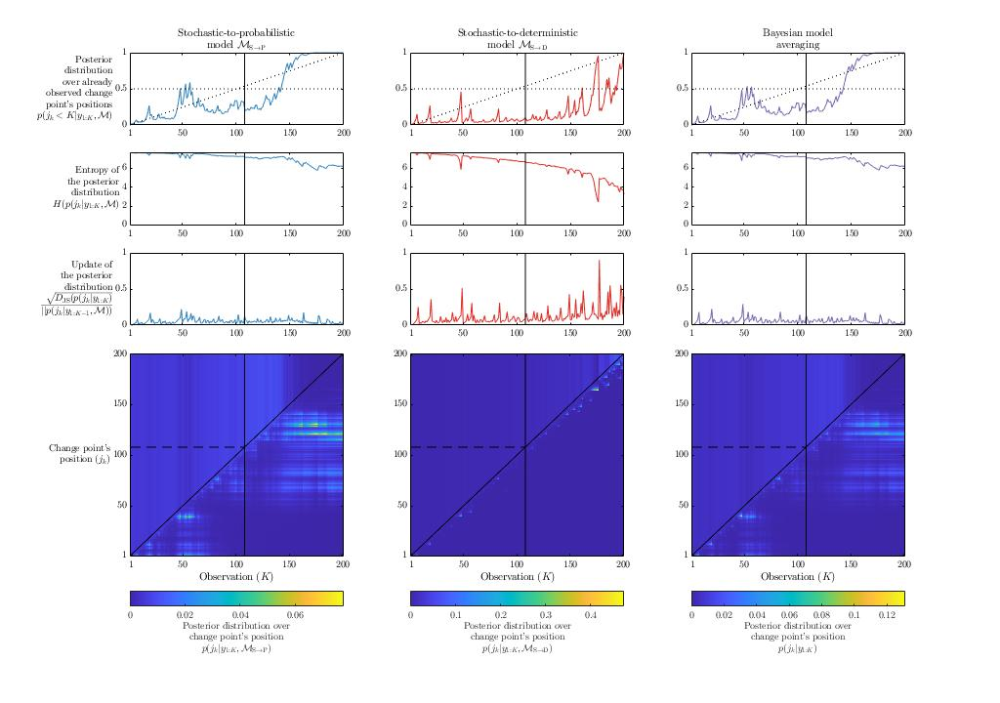

# Ideal observer

## Scripts and functions

The different observers available are:
* ```Emergence_IO_Bernoulli``` estimates the frequency of A and B.
* ```Emergence_IO_Markov``` estimates the frequency of first-order transitions (A|A, A|B, B|A, and B|B).
* ```Emergence_IO_Chain``` estimates the frequency of transitions of any order.
* ```Emergence_IO_Tree``` detects repetition of pattern of any length up to a given limit.

The full Bayesian ideal observer of the task is implemented in  ```Emergence_IO_FullIO``` and considers there might be a change point in the sequence separating a fully-stochastic part from a regular part that can be described using one of the previous observers.

Toy examples scripts are available for each of there observers.

## Full Bayesian ideal observer of the task

Here is the result of the inference by the full Bayesian ideal observer of the task (the function ```Emergence_IO_FullIO```).
These figures can be reproduced using the script ```Emergence_IO_ToyExampleFullIO```.

### Posterior probability of

We estimate the posterior probability of each possible model:

<p align="center">
<a href="https://www.codecogs.com/eqnedit.php?latex=p\left(\mathcal{M}_{i}|y\right)&space;=&space;\frac{p\left(y|\mathcal{M}_{i}\right)&space;\cdot&space;p\left(\mathcal{M}_{i}\right)}{p\left(y\right)}" target="_blank"></a>
</p>

For the fully-stochastic hypothesis, the sequence likelihood is defined as:

<p align="center">
<a href="https://www.codecogs.com/eqnedit.php?latex=p\left(y_{1:K}|\mathcal{M}_{\text{S}}\right)&space;=&space;p\left(\mathrm{A}\right)^{N_{y_{1:K}}^{\mathrm{A}}}&space;&plus;&space;p\left(\mathrm{B}\right)^{N_{y_{1:K}}^{\mathrm{B}}}&space;=&space;\left(\frac{1}{2}\right)^{K}" target="_blank"></a>
</p>

For the regular hypotheses, we must marginalize over change point's positions:

<p align="center">
<a href="https://www.codecogs.com/eqnedit.php?latex=p\left(y_{1:K}|\mathcal{M}_{\mathrm{S}\rightarrow&space;i}\right)&space;=&space;\sum_{k=1}^{K-1}&space;p\left(y_{1:K}|j_{k},\mathcal{M}_{\mathrm{S}\rightarrow&space;i}\right)&space;\cdot&space;p\left(j_{k}\right)&space;\\&space;p\left(y_{1:K}|j_{k},\mathcal{M}_{\mathrm{S}\rightarrow&space;i}\right)&space;=&space;p\left(y_{1:k}|\mathcal{M}_{\mathrm{S}}\right)&space;\cdot&space;p\left(y_{k&plus;1:K}|\mathcal{M}_{i}\right)" target="_blank"></a>
</p>

In the case of the stochastic-to-probabilistic hypothesis, the likelihood of the regular part sequence is defined as:

<p align="center">
  <a href="https://www.codecogs.com/eqnedit.php?latex=p\left(y_{k&plus;1:K}|\mathcal{M}_{\mathrm{P}}\right)&space;=&space;\int_{0}^{1}&space;p\left(y_{k&plus;1:K}|\theta,\mathcal{M}_{\mathrm{P}}\right)&space;\cdot&space;p\left(\theta|\mathcal{M}_{\mathrm{P}}\right)&space;\mathrm{d}\theta&space;\\&space;p\left(y_{k&plus;1:K}|\mathcal{M}_{\mathrm{P}}\right)&space;=&space;\frac{1}{2}&space;\cdot&space;\prod_{\text{X}\in\{\text{A},\text{B}\}}&space;\frac{\prod_{\text{Y}\in\{\text{A},\text{B}\}}&space;\Gamma&space;\left(N^{\text{Y}|\text{X}}&plus;1\right)}{\Gamma&space;\left(\sum_{\text{Y}&space;=&space;\{\text{A},\text{B}\}}&space;N^{\text{Y}|\text{X}}&plus;1\right)}" target="_blank"></a>
</p>

In the case of the stochastic-to-deterministic hypothesis, the likelihood of the regular part sequence is defined as:

<p align="center">
  <a href="https://www.codecogs.com/eqnedit.php?latex=p\left(y_{k&plus;1:K}|\mathcal{M}_{\text{D}}\right)&space;=&space;\sum_{r\in\{\mathcal{R}\}}&space;p\left(y_{k&plus;1:K}|r,\mathcal{M}_{\text{D}}\right)&space;\cdot&space;p\left(r|\mathcal{M}_{\text{D}}\right)&space;\\&space;p\left(y_{k&plus;1:K}|\mathcal{M}_{\text{D}}\right)&space;=&space;\frac{1}{2}&space;\cdot&space;\left(\sum_{i=1}^{\min\left(K,\nu\right)}&space;(y_{k&plus;1:K}&space;\equiv&space;[y_{k&plus;1:k&plus;i}]^{n})&space;\cdot&space;\frac{1}{3^{i}}&space;&plus;&space;\sum_{i=K&plus;1}^{\nu}&space;2^{i-K}&space;\cdot&space;\frac{1}{3^{i}}\right)" target="_blank"></a>
</p>

The first group of plots from ```Emergence_IO_ToyExampleFullIO``` display the posterior distribution over models (and related metrics).

<p align="center">
  
</p>

### Posterior distribution over models' parameters

The second group of plots from ```Emergence_IO_ToyExampleFullIO``` display the posterior distribution over models' parameters.

<p align="center">
  
</p>

### Posterior distribution over change point's position

The third group of plots from ```Emergence_IO_ToyExampleFullIO``` display the posterior distribution over change point's position (and related metrics).

<p align="center">
  
</p>

### Expectation and surprise

The fourth group of plots from ```Emergence_IO_ToyExampleFullIO``` display the expectations regarding the identity of the next observation (and related metrics).

<p align="center">
  
</p>
